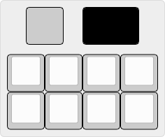

# QMK Configurations

So, sometimes I have mech keyboard-related ideas, and other times I break my own keyboards.  
These are my ideas and my damage control plans.  

## Hakase

IoT macro pad. Thought that internet-connected lightbulbs were a bad idea? Well I internet-connected a keyboard.  
Basically a normal macro pad that can interface with your smart home.  
